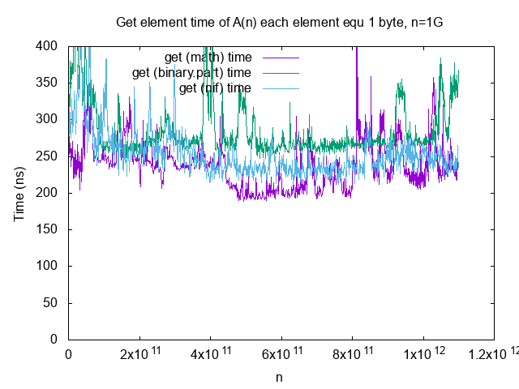
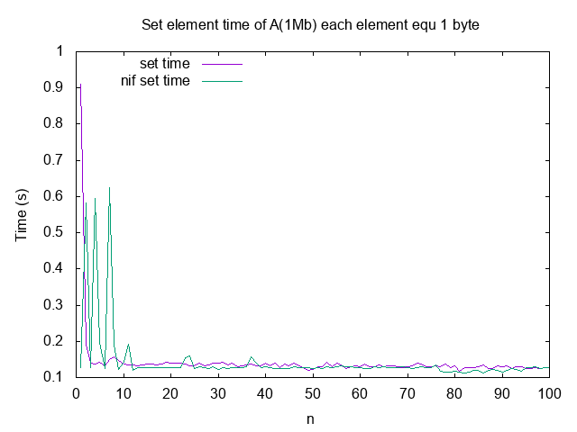
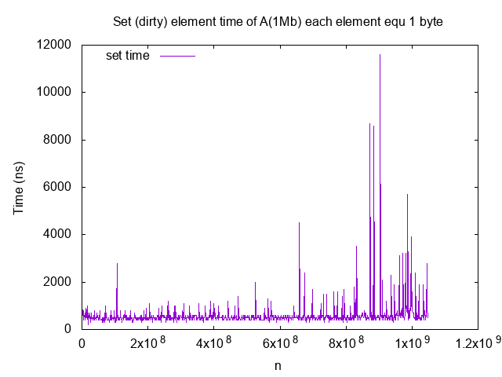

# Barray

Array of fixed size type in array. The array is stored in a standard erlang binary. For example, an array of 10 elements of 1 byte is stored in binary `<<1, 2, 3, 4, 5, 6, 7, 8, 9, 10>>`.

## Installation

```elixir
def deps do
  [
    {:barray, git: "git@github.com:UA3MQJ/barray.git", tag: "1.0.1"},
  ]
end
```

## Usage

Create array of 1M elements. Each element is 1024 bytes

```elixir
iex(1)> arr = Barray.new(1024, 1024*1024); nil
                          ^        ^
                          |        |
                element size      elements count
```

Set some data

```elixir
iex(1)> element_size = 1024
iex(2)> some_data = :binary.copy(<<255>>, element_size)
iex(3)> some_index = 500_000
iex(4)> arr = arr |> Barray.set(some_data, some_index); nil
```

Get data

```elixir
iex(5)> arr |> Barray.get(element_size, some_index)
<<255, 255, 255, 255, 255, 255, 255, 255, 255, 255, 255, 255, 255, 255, 255,
  255, 255, 255, 255, 255, 255, 255, 255, 255, 255, 255, 255, 255, 255, 255,
  255, 255, 255, 255, 255, 255, 255, 255, 255, 255, 255, 255, 255, 255, 255,
  255, 255, 255, 255, 255, ...>>
  
iex(6)> some_data == arr |> Barray.get(element_size, some_index)
true
```

## Dirty part

Each array update is a update of binary. Each update will create a new copy of the array (due to data immutable). This is an additional memory consumption. The speed is also lost due to the fact that you need not only to allocate memory, but also copy data. With an array size of 1 megabyte, the update takes about ~ 0.15s. It's very slow.

If you refuse the immutability of the array, then you can get the speed. To do this, I developed a Nif-functin.

```elixir
iex(9)> arr = <<1, 2, 3, 4, 5, 6, 7>>
<<1, 2, 3, 4, 5, 6, 7>>
iex(10)> :ok = Barray.dirty_set(arr, <<0, 0>>, 0)
:ok  <--- Return :ok, not array!
iex(11)> arr
<<0, 0, 3, 4, 5, 6, 7>>
```

Operation dirty_set speed of the order of 1000ns or less

## Other comments

When create array via function `Barray.new(size, elements_count)` no guarantees are given that the array will be filled with <<0>>. But the function works fast because it is Nif-function. It matters if the size of the array is several gigabytes.

```elixir
iex(15)> Barray.new(1, 10)
<<0, 0, 0, 0, 0, 0, 0, 0, 1, 0>>
iex(16)> Barray.new(1, 10)
<<0, 0, 0, 0, 0, 0, 0, 0, 3, 0>>
```

If the initial value of the elements is important, use the function `Barray.new(element, elements_count)`

```elixir
iex(18)> Barray.new(<<0, 255>>, 4)
<<0, 255, 0, 255, 0, 255, 0, 255>>
```

## Performance

Create time of array A(n) each element equ 1Kb when n=1..1000


Create time of array A(n) each element equ 1Mb when n=1, 2, 4, 8, 16, 32, 64, 128, 256, 512, 1024, 2048, 4096, 8192, 10000 elements


Get element time from 1G array approximately average 200ns



Writing to an array is very slow. Depends on the size of the array. For 1mb archive, set time is ~0,15s



Dirty update immutabble binary. Fast. Not safe for multithread. Approximately average 350ns



## Thanks

 * [High-loaded systems developer contest](https://highloadcup.ru)
 * [TenderPro company](tender.pro)
 * Alex Golubov
 * Max Pavlenko
 * Sergio Tulentsev
