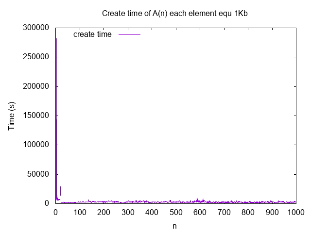

# Barray

Array of fixed size type in array

## Installation

```elixir
def deps do
  [
    {:barray, git: "git@github.com:UA3MQJ/barray.git", tag: "0.1.0"},
  ]
end
```
## Usage
1M elements of 1024bytes
```elixir
iex(1)> arr = Barray.new(1024, 1024*1024); nil

```
Set some data
```elixir
iex(2)> some_data = :binary.copy(<<255>>, 1024)
iex(3)> some_index = 500_000
iex(4)> arr = arr |> Barray.set(some_data, some_index); nil
```
Get data
```elixir
iex(5)> some_data == arr |> Barray.get(1024, some_index)
true
```

## Performance

Create time of array A(n) each element equ 1Kb when n=1..1000



Create time of array A(n) each element equ 1Mb when n=1, 2, 4, 8, 16, 32, 64, 128, 256, 512, 1024, 2048, 4096, 8192, 10000

